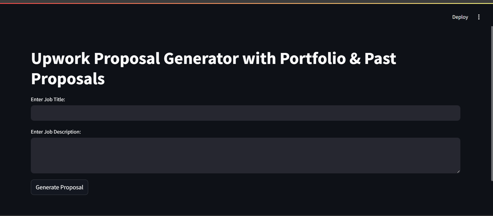

# Upwork Proposal Generator with RAG (HuggingFace Embeddings)

  

This project builds a Streamlit-based AI Agent that generates Upwork proposals using Retrieval-Augmented Generation (RAG). It smartly selects portfolio items and formats proposals based on past examples, using HuggingFace sentence embeddings.

  

## Features

|  Feature |  Description |
|--|--|
| 📝 Proposal Generation | Creates professional proposals from job titles/descriptions |
| 🔍 Semantic Matching | Finds most relevant portfolio items using embeddings |
| 📚 RAG Integration | Uses past proposals as examples for better formatting |
| 🛠️ Tech Stack | Streamlit, LangChain, HuggingFace, ChromaDB |

  

## Project Structure

  

```text
Upwork-Proposal-Generator/
│
├── app/
│ ├── main.py # Streamlit application
│ ├── proposal_generator.py # Core generation logic
│ └── utils.py # Helper functions
│
├── data/
│ ├── sample.csv # Portfolio items
│ └── proposals.json # Past proposal examples
│
├── vectorstore/ # ChromaDB vector storage
│ ├── chroma-collections.parquet
│ └── chroma-embeddings.parquet
│
├── .env # Environment variables
├── requirements.txt # Python dependencies
└── README.md # This documentation
```

## 🛠️ Installation

### Prerequisites

- Python 3.8 or higher
- Git (for cloning the repository)
- [Pip](https://pip.pypa.io/en/stable/installation/) (Python package manager)


### Step-by-Step Setup

1. **Clone the repository**:

```bash
git clone https://github.com/ashadx/Upwork-Proposal-Generator.git
cd Upwork-Proposal-Generator
```
2. **Create a virtual environment** (recommended):
```bash
python -m venv venv
```
3. **Activate the environment**:
		- ***Windows***:
			   ```bash
			venv\Scripts\activate
			```
		- **macOS/Linux**:
				```bash
			source venv/bin/activate
			```
			
4. **Install dependencies**:
		```bash
		pip install -r requirements.txt
		```
5. **Set up environment variables**:
	-   Create a  `.env`  file in the project root 

## Run the App
```bash
streamlit run app.py
```

## How It Works

1. **Input**  
   You provide the **Job Title** and **Job Description** of the freelance job you want to apply for.

2. **Portfolio Matching**  
   The system uses **HuggingFace sentence-transformers embeddings** to convert your job title and description into vector representations.  
   It then compares these vectors against embeddings of your portfolio entries (from `sample.csv`) to find the most relevant portfolio links.

3. **Retrieve Past Proposals**  
   It uses a **Retrieval-Augmented Generation (RAG)** approach by searching a database of your previous proposals (stored in `proposals.json`) to find similar proposals matching the current job context.

4. **Generate Proposal**  
   Using **LangChain** and the matched portfolio URLs plus retrieved past proposals, the system crafts a customized and persuasive proposal message.

5. **Output**  
   The final proposal text is displayed to you, ready to be sent to the client.


## UI Screenshot



---

## Created By

**Asad Aslam**  
[GitHub](https://github.com/ashadx) | [LinkedIn](https://linkedin.com/in/asadaslam330)  
Email: asadaslam330@gmail.com
